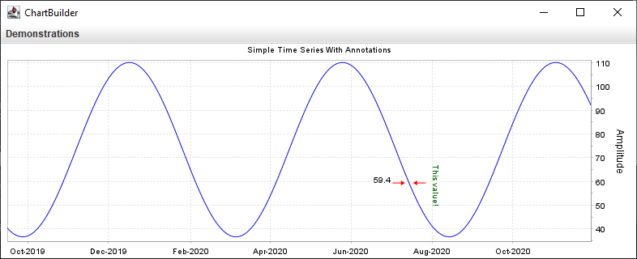
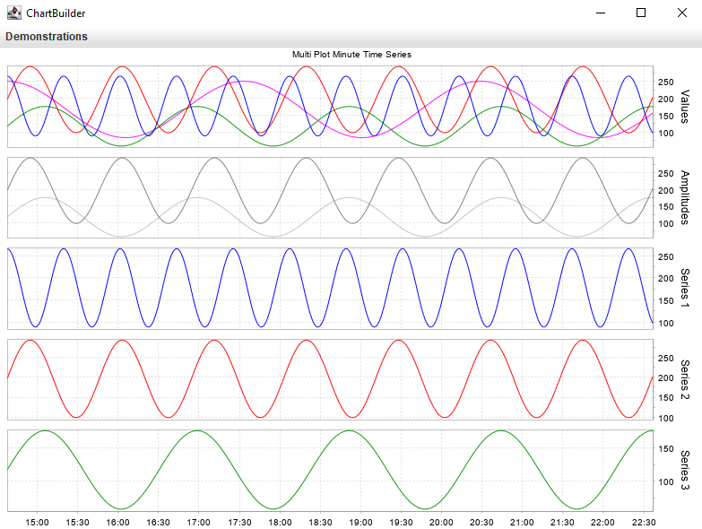
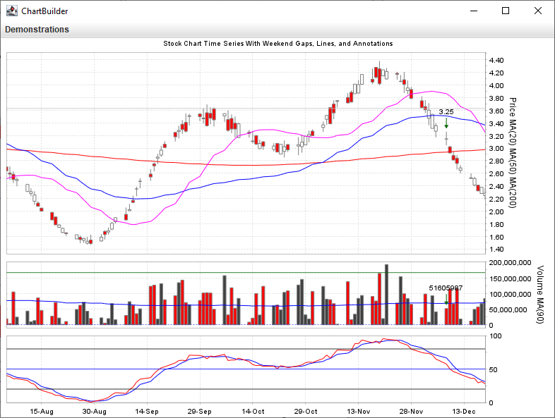
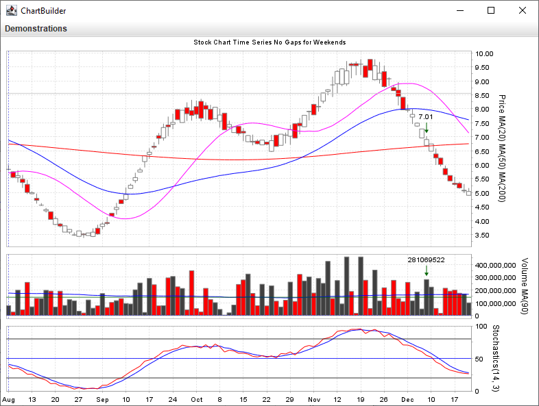

# jfreechart-builder-demo

A demonstration app for using the [jfreechart-builder](https://github.com/matoos32/jfreechart-builder) module.


## Demonstrations

 The app generates random series then uses ***jfreechart-builder*** to plot them. Click the **Demonstrations** drop-down menu to see various builder results. Verify what you see against the source code to understnad what is happening.


### Samples










## Versioning

Uses the version number matching that of **jfreechart-builder**.


## Branching model

If you want the latest and greatest contributions use the `develop` branch. These commits have not yet been merged into `main` nor received a version tag, but give you a preview of what's to come.

Each time `develop` is merged into `main`, a version tag is added onto that merge commit so that each commit to `main` represents the next version.


## Prerequisites

* JDK 8 or greater [[1](https://openjdk.java.net/)] [[2](https://www.oracle.com/java/)] installed.
* [Apache Maven](https://maven.apache.org/) installed.
* Internet connection for Maven downloads or you add them to your local Maven repo by other means.


## Installing the source code

```
git clone <this repo's URL>
```


## Building and installing the JAR

```
cd path/to/cloned/repo

git checkout <desired branch or tag>

mvn package
```

The jar will be in the `target/` folder.


## Running the app

```
javaw -jar target/jfreechart-builder-demo-1.5.6.jar
```


## License

This project is provided under the terms of the [LGPL 2.1 license](./license-LGPL.txt).

You should be aware that, by virtue of the Maven Shade plugin, the app JAR file that is created will contain the compiled `.class` files of:

* The [jfreechart-builder](https://github.com/matoos32/jfreechart-builder) module (LGPL 2.1 license)
* The [jfreechart](https://github.com/jfree/jfreechart) library (LGPL 2.1 license)

If you need clarification on the LGPL vs. Java, please see the [FSF's tech note about it](https://www.gnu.org/licenses/lgpl-java.html).


## Contributing

Contributions are welcome and will be accepted as the maintainers' time permits.

Please use indentations of two spaces (no tabs) and wrap lines at a max width of 100 characters.
