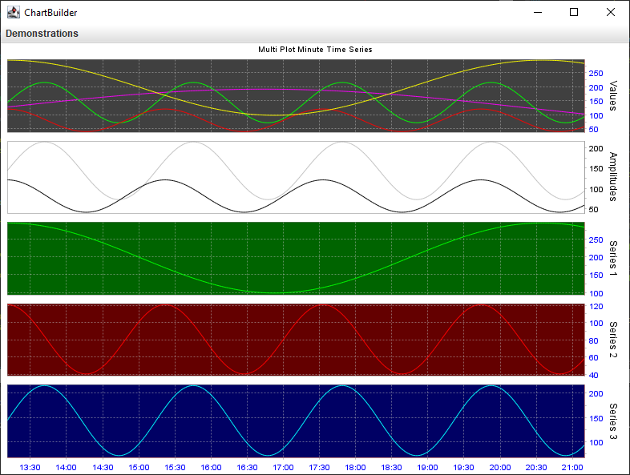
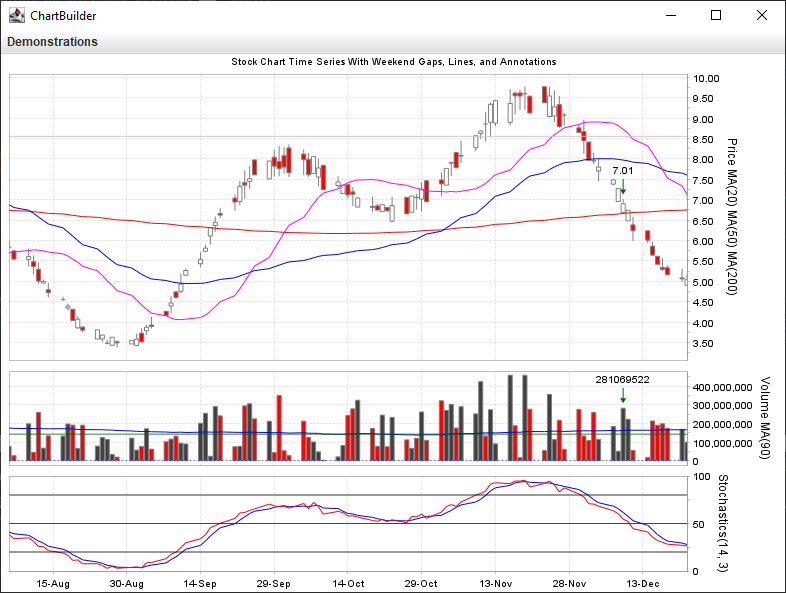

# jfreechart-builder-demo

A demonstration app for using the [jfreechart-builder](https://github.com/matoos32/jfreechart-builder) module.

Click the **Demonstrations** drop-down menu to see various builder results. The app generates random series then uses the builder framework to plot them.

Verify what you see against the source code to understnad what is happening.





## License

The source code in this project is provided under the terms of the [LGPL 2.1 license](./LICENSE).

You should be aware that, by virtue of the Maven Shade plugin, the app JAR file that is created will contain the compiled `.class` files of:

* The [jfreechart-builder](https://github.com/matoos32/jfreechart-builder) module (LGPL 2.1 license)
* The [jfreechart](https://github.com/jfree/jfreechart) library (LGPL 2.1 license)


## Building Prerequisites

* JDK 8 or greater [[1](https://openjdk.java.net/)] [[2](https://www.oracle.com/java/)] installed.
* [Apache Maven](https://maven.apache.org/) installed.
* Internet connection so Maven can download artifacts or you provide and install those into your local Maven repo by alternative means.


## Installing the source code

Clone this git repo locally.


## Building the app

```
cd path/to/the/cloned/repo
```

Use `git` to checkout the desired branch or tag.

```
mvn package
```


## Running the app

```
javaw -jar target/jfreechart-builder-demo-1.5.0.jar
```
